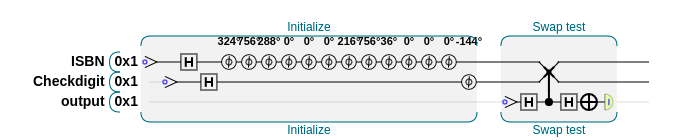

# Quantum ISBN validator
Copyright (c) 2022 Charles Horn. 

Implements a quantum algorithm to validate ISBN check digits using a single qubit.

It accepts 10 digit and 13 digit ISBNs. 10 digit ISBNs use a different checkdigit validation scheme. In this algorithm that corresponds to a slightly different phase encoding of each digit on the single qubit. 

Because ISBN-13s are EAN-13s (aka GTIN-13), it will also validate checkdigits of those 13 digit product codes, commonly found on various products as barcodes.

## Goal
Apply practical quantum computing to the problem of ISBN validation; primarily for education and illustrative purposes.

## Algorithm description

ISBN checkdigits are determined via a weighted sum modulo _n_ operation. Validating the checkdigit is achieved by performing a similar weighted sum of all digits, including the checkdigit, and confirming the modulo _n_ result is 0.

### Quantum implementation

First we put our single qubit into a superposition state by setting it to **|1>**, then applying the Hadamard operation.

Encoding each weighted digit as multiples of a qubit phase rotation of _θ_ (dependant on the particular modulus) on a single qubit allows the sum to be built up.

* For ISBN-13; _θ_ = 2π/10 radians
* For ISBN-10; _θ_ = 2π/11 radians

The weighting is a function of the digit position. In the ISBN-13 scheme, odd positions have a x3 weighting. In the ISBN-10 scheme each digit is weighted by its position (leftmost digit is 10).
In this quantum implementation, this is the required encoding step to get our classical data into our quantum system.

To verify the check digit, we apply another Hadamard operation and then read the qubit. Only a correct checkdigit will provide 100% probability of reading a **1**.

For consistency in the qubit results, the code encodes input values with neither 10 nor 13 digits as a single phase rotation of 180 degrees to ensure 100% probability of reading a **0**, which can indicate the input was not recognised as an ISBN at all. (Otherwise a PHASE rotation of 0 looks like a validation). Some correct length ISBN-like values can produce this guaranteed **0** too, but they will have invalid checkdigits.

`matplotlib` output for a ISBN-13 validation circuit:


## Usage examples
Requires Python, [Qiskit](https://qiskit.org/), and `matplotlib` (for displaying the quantum circuits).


Positive validation:
```
$ ./qisbn.py 9781492039686
Validating ISBN 9781492039686...
Shots: 300
Counts: {'1': 300}
ISBN 9781492039686 validates!
```
Negative result:
```
$ ./qisbn.py 9781492039684
Validating ISBN 9781492039684...
Shots: 300
Counts: {'0': 98, '1': 202}
9781492039684 does not validate!
```

## Original circuit
Below is the original version of my validation algorithm attempt, which uses 3 qubits and a swap check to determine whether the weighted sum modulo _n_ is equal to the phase encoded checkdigit (negative rotation).
The circuit is a bit more interesting and gives the same result, but after creating it and seeing how it worked, I realised it was uneccesarily complex and could be simplified to use
only one qubit for the same functionality.

Here is that earlier circuit drawn using [QCEngine](https://oreilly-qc.github.io/docs/build/index.html):




## License
This project is licensed under the terms of the [MIT license](LICENSE.txt).
